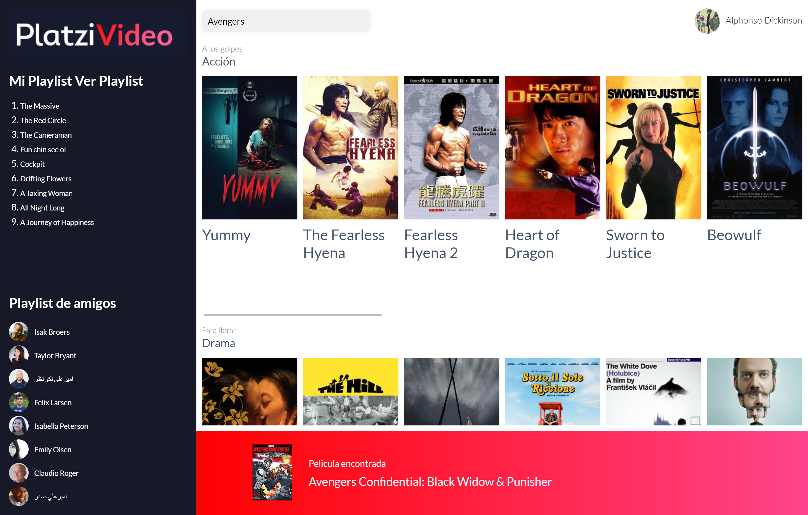

# Platzi Video (old)

¡Bienvenido y gracias por visitarme! Este es un proyecto elaborado como proyecto de aprendizaje del jQuery-js en [Platzi](https://platzi.com/cursos/jquery-js/) en donde aplico varios de los conocimientos y habilidades adquiridas, entre ellas:

- Optimizar código y funciones en JS
- Conocer las extensiones de los preprocesadores a HTML y CSS
- Hacer desarrollos con JS sin depender de jQueryCrear páginas dinámicas y animaciones en poco tiempo

## Vista de Home

[Ver Home](https://diegoalesco95.github.io/Jquery-to-JavaScript/index.html)

## Licencia

[MIT License](LICENSE)
